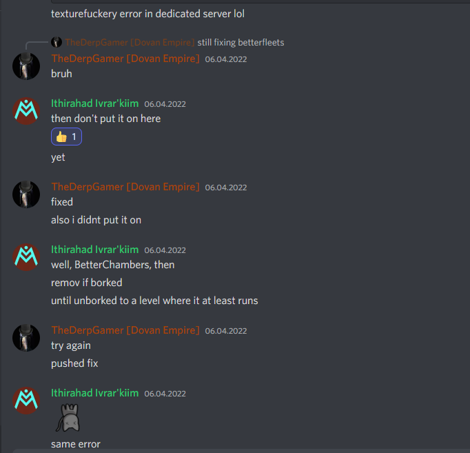
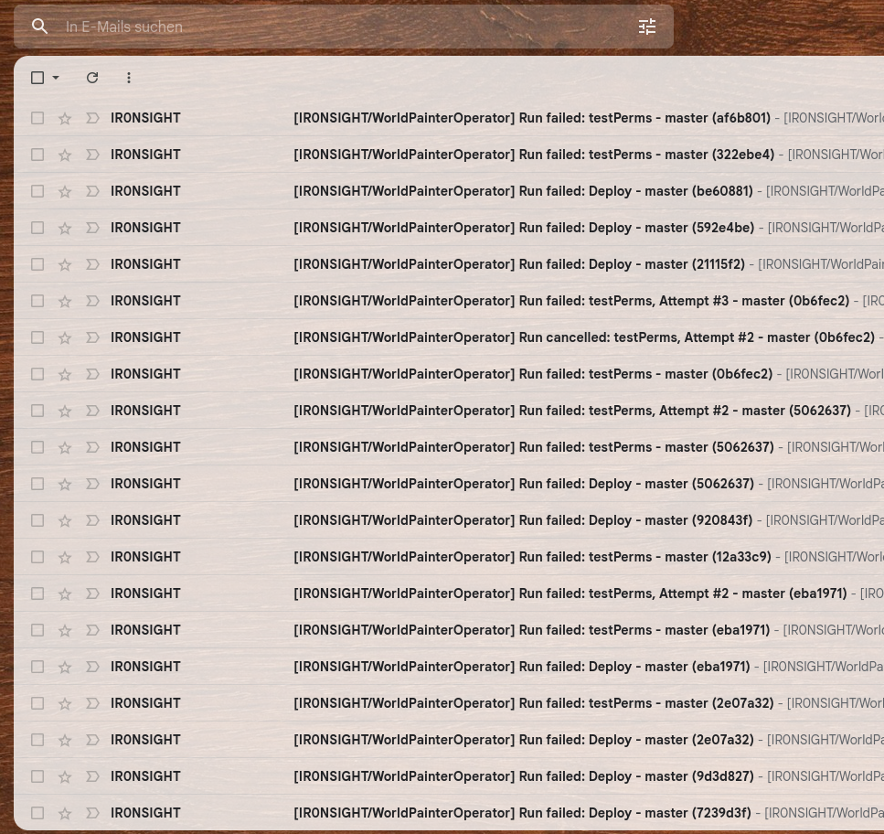

# Testing
- Manuelle Tests
- Automatische Tests
- CI Pipeline

Ich habe ein Feature gebaut.
Kaffeemaschinen können damit ein Selbstreinigungsprogram ausführen.
Ich hab meinen Code ausprobiert, der funktioniert. PR, lets go.
Warum soll ich mir extra Arbeit machen und Tests bauen? Es tut doch!
Der Fix kann direkt live gehen, ich weiss ja dass es keine Probleme gibt

=> Ja, auf deinem System, in deiner Umgebung
=> Ja, das behauptest du. Aber für mich als Reviewer gibt es keinen Beweis dass der Code tatsächlich funktioniert

Lifestyle basierend auf "__trust me bro, it works__"
Effekt: Halbfunktionierende Features leben jahrelang im Code
(Anekdote aus Starmade, getShipBlockComposition)

Jedes Mal wenn ich den master pulle und beim builden ein Fehler auftritt, kocht mein Blut
- Features haben gefälligst zu funktionieren beim merge
- der master muss immer baubar sein. (Compilation bei python nicht so wichtig, aber von Gedanke her)




Direkter Nutzen von Tests:
Unit Tests zwingen den Entwickler einen Beweis für die Funktionalität des Features zu geben.
Der Test ist ein Beispiel für die Verwendung des Features
    => dient als auch der Doku 
Feature muss so gebaut sein, dass es einfach, unabhängig im Test laufen kann => Modularität
Im Test kann ich ablesen, welche Edgecases abgedeckt sind (also auch welche nicht).

Langfristiger Nutzen:
Szenario:
Ich ändere die Farbe des "Cappucino" Buttons auf der Kaffeemaschine.
Rot => Blau
Sieht gut aus, Maschine hat einen Cappucino problemlos gemacht.
Push, PR, Merge

Kollege pulled master, auf einmal sind alle Betonmischanlagen kapput.
Irgendwo war die Cappucino Taste an die dran gekoppelt.
Kollege ist entweder blockiert oder er muss deinen PR debuggen.
Freude kommt auf.
Auf den ersten Blick komplett unrelatede Events, auch im Review nicht aufgefallen.

(Man darf Fehler machen, solange man sie nicht fahrlässig macht und anderen die Arbeit abbekommen.)

Hätte der Betonmischer einen Test gehabt, wäre der Bug schon beim Push aufgefallen.

Aber hatte er nicht, deshalb bist du jetzt verantwortlich dass dein Team den Freitag abend damit verbringt zu debuggen.
Ein einfaches "npm run test" hätte diese ganze Situation von vornerein verhindert.
 __Sicher dich ab, schreib Tests.__

## Test types
Nicht jeder Test ist gleich Test
### Unit Tests
Test lokal eine einzelne Funktion.
Kurz, knackig, beweist, dass die Funktion das produziert, was sie soll
Funktion wird isoliert und getestet.
```py 
    assert(add(1,1),2)
    assert(add(1,-1),0) 
    assert(add(100000,1),100001)
```
./src/geometry/test_square.py

Negativ Beispiel:
https://github.com/Schine/StarMade-Open/pull/57/files

### Integration Tests
Ich baue ein Feature: User kann sein eigenes Kaffee Rezept in die Kaffeemaschinen app hochladen als JSON, und die Maschine braut ihm danach den Kaffee.
Mein Modul besteht aus 15 internen Funktionen, das Interface hat Schnittstellen: 
```py
    def uploadUserCoffee(data: json) => void:
        ...

    def produceSpecialCoffee() => void:
        ...
```
Also wie teste ich das ganze? Klar, Webapp starten, einloggen, navigiere zu "custom coffee", JSON hochladen, enter drücken, kaffee kommt, wars der richtige Kaffee? Hm nee irgendwie falsch.
Nochmal, repeat
5 mal getestet, der Tag ist rum. Gefundene Edgecases und Bugs: 0
Ich WÜRDE ja gerne isoliert testen, aber die App muss laufen, weil meine Funktion den State der Maschine verwendet usw., kann also nicht isoliert testen.

Stattdessen:
Umbauen, solange bis das Modul keine unsichtbaren Seiteneffekte mehr braucht.
```py
    def uploadUserCoffee(data: json, machine: Coffeemachine) => Coffeemachine:
        ...

    def produceSpecialCoffee(machine: Coffeemachine) => Coffee:
        ...

    def testCustomCoffee():
        mockMachine = { beans: 100, userCoffee: null, water: 100};
        userData = { beans: 3, water: 1, sugar: 0}
        mockMachine = uploadUserCoffee( data=userData, machine=mockMachine)

        assert(mockMachine.userCoffee = userData)

        outCoffee = produceSpecialCoffee(mockMachine)
        assert(outCoffee.beans = 3)
        assert(outCoffee.water = 1)
        assert(outCoffee.sugar = 1)
```
Funktionaler Ansatz erleichtert das Testen.
Objektorientierte Programmierung tendiert oft zu Seiteneffekten, die am Tester vorbei irgendwo her Daten holen, sodass man die Welt nur schlecht mocken kann.


### End To End Tests
Teste die gesamte Anwendung.
Starte die App, render die Website, ein zweites Programm fängt an sich durch die App zu klicken und prüft ob alles wie erwartet aussieht.
Kompliziert aufzusetzen, flakey weil HTML und Performance, braucht lange zum Durchlaufen (60 sek vs 0.1 sek bei Unit test)
Nervig zu debuggen.
Für uns tendentiell zu aufwändig mit zu wenig Benefit.

### Test driven developement
Philosophie der Softwareentwicklung
"Bei der testgetriebenen Entwicklung erstellt der Programmierer Softwaretests konsequent __vor__ den zu testenden Komponenten." - Wikipedia
Radikalste Alternative zu: Wir bauen erstmal die App, und am Schluss wenn noch Zeit ist, ein paar Tests.
Quasi: Zuerst baue ich meine Tests, die meine Spezifikation abdecken.
Dann baue ich Schritt für Schritt mein Feature, bis es alle Tests erfüllt.

Eigene Meinung: Relevante Komponenten sollten Tests haben, die bei Bauen des features committed werden.
Vorgeschlagene Regel: Pro feature-PR muss mind. ein Test vorliegen, der die Funktionalität beweist und edge cases testet.
=> Garantie der Funktionalität, Sicherheit gegen zukünftige Bugs, usw

# Testen in Python
```py
    #by default immer dabei:
    assert(True)
    assert(False, "Hello World")
```

Für meinen Integration test brauche ich ein setup:
ich muss erst meine datenbank anbindung mocken, dann x, dann y, dann testen.
und ich habe 12 tests, die alle das selbe setup brauchen.
Und nach dem Test muss ich alles wieder löschen, bevor der nächste Test läuft.
Ich brauchen eine __Fixture__.
#### Pytest
https://docs.pytest.org/en/7.3.x/getting-started.html#get-started

pytest-coverage plugin
$ pytest --cov --cov-report=html
$ pytest --cov
https://docs.pytest.org/en/latest/how-to/assert.html#assert-introspection


## Automated Testing
Okay, ich habe viele tolle Tests, mit 100% coverage.
Schnell noch den Fix pushen, und fertig.
Und der Master ist wieder kaputt, ich hab vergessen nach der letzten tiny Änderung nochmal die Tests laufen zu lassen

Der Lifestyle ist nicht mehr
"Trust me bro, it works"
sondern
"Trust me bro, i ran the tests"

Daumenregel: Wenn man ständig den selben Task wiederholt, dann automatisieren wir.
### Github actions
Was ist eine Github action und wo kann man sie kaufen?
Ziel: Jedes mal wenn irgendjemand, auf irgend einem Branch ins Repo pushed, dann laufen ALLE existierenden Tests durch, und beschweren sich lautstark wenn sie failen
"Send email on failed action"


_GITHUB_ action:
von github bereitgestellte VM, die irgendwo online läuft, auf der man Kommandos ausführen kann.
Actions werden als .yml dateien in .github/workflow abgelegt
Github findet die .ymls automagisch, und führt sie aus

Jede Action startet als blanke VM
__LIVE BEISPIEL__

https://github.com/IR0NSIGHT/PythonTestShowcase